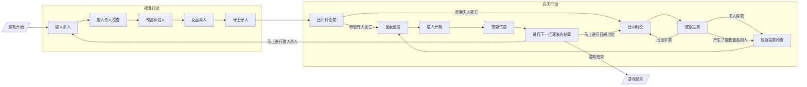

```mermaid
graph LR
    游戏开始[/游戏开始/] --> 狼人杀人
    狼人杀人 --> 狼人杀人检查
    狼人杀人检查 --> 预言家验人
    预言家验人 --> 女巫毒人
    女巫毒人 --> 守卫守人
    守卫守人 --> 日间讨论前

    subgraph 夜晚行动
        狼人杀人
        狼人杀人检查
        预言家验人
        女巫毒人
        守卫守人
    end

    日间讨论前 --昨晚有人死亡--> 发表遗言
    日间讨论前 --昨晚无人死亡 --> 日间讨论
    发表遗言 --> 猎人开枪
    猎人开枪 --> 警徽传递
    警徽传递 --> 进行下一位死者的结算
    进行下一位死者的结算 --游戏结束 --> 游戏结束[/游戏结束/]
    进行下一位死者的结算 --马上进行日间讨论 --> 日间讨论
    进行下一位死者的结算 --马上进行狼人杀人 --> 狼人杀人

    subgraph 白天行动
        日间讨论前
        发表遗言
        猎人开枪
        警徽传递
        进行下一位死者的结算
        日间讨论
        放逐投票
        放逐投票检查
    end

    日间讨论 --> 放逐投票
    放逐投票 --出现平票 --> 日间讨论
    放逐投票 --无人投票 --> 放逐投票检查
    放逐投票 --产生了票数最高的人 --> 放逐投票检查
    放逐投票检查 --> 发表遗言
```
